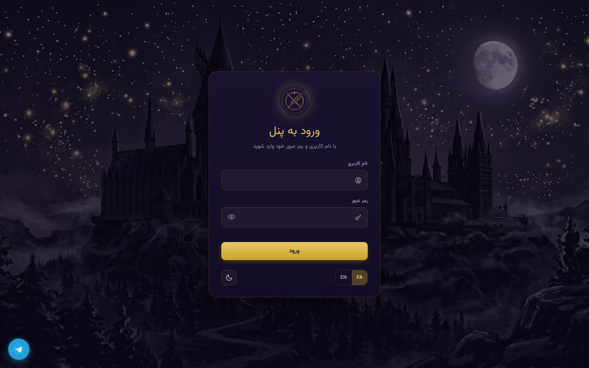
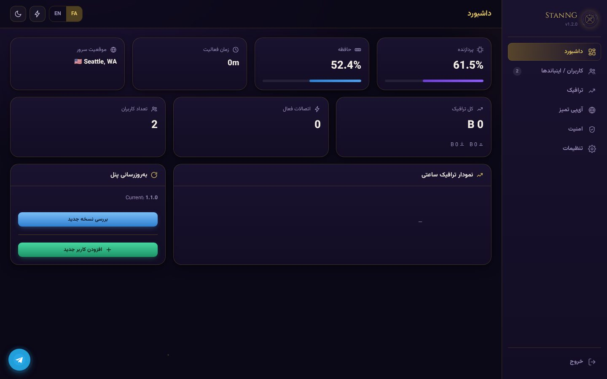
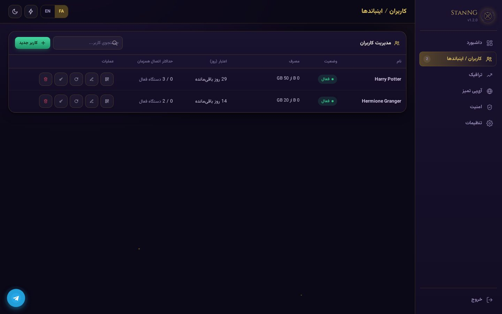
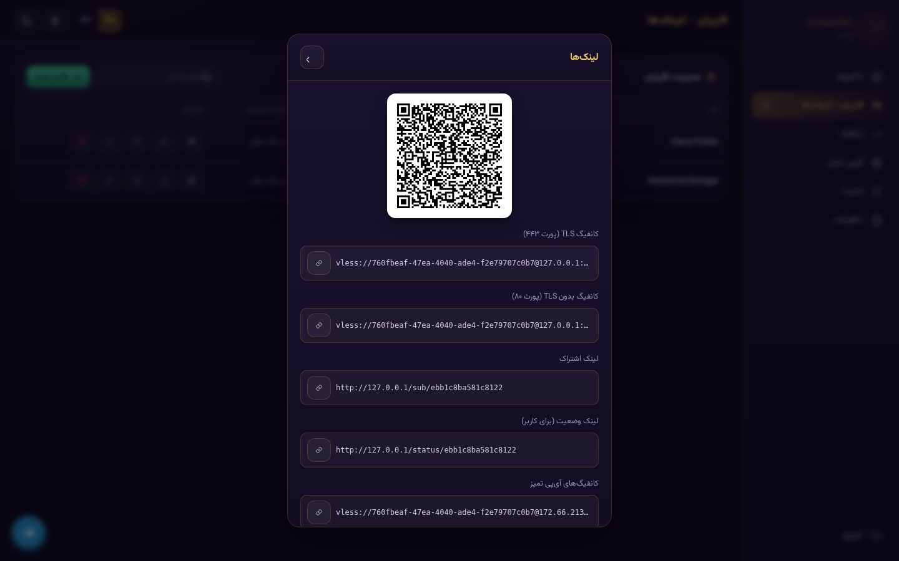
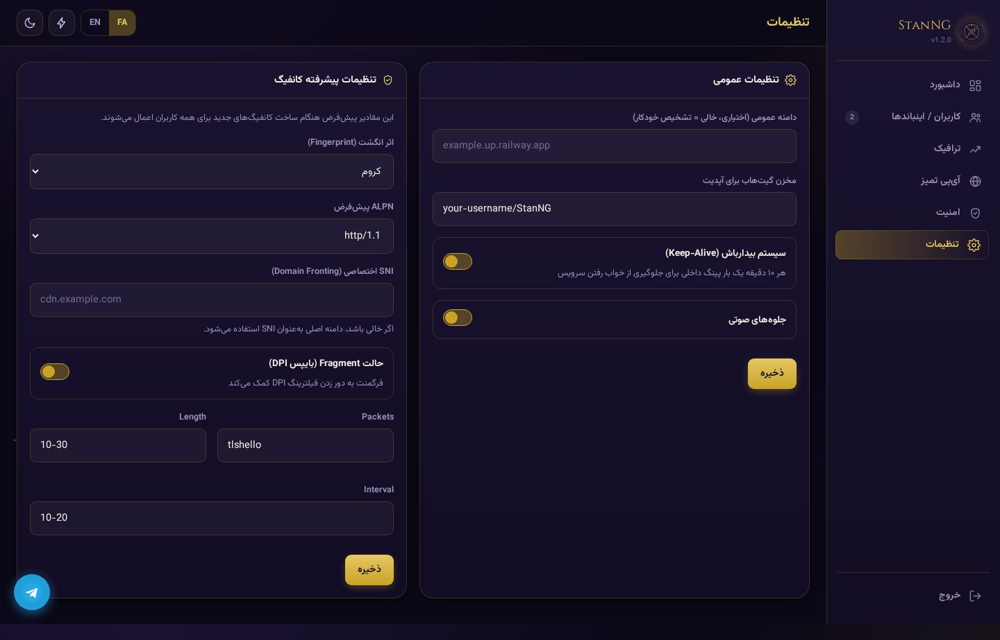
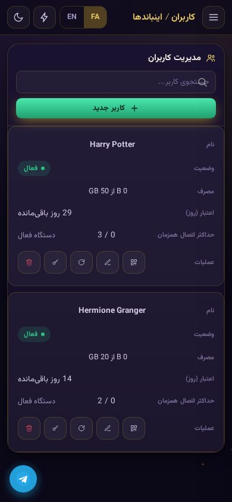

<div align="center">


# ⚡ StanNG

### یک پنل تک‌سرویسه VLESS-over-WebSocket با تم دنیای جادوگری

**A single-service, database-free VLESS-over-WebSocket panel — wizarding-academy themed, bilingual (فارسی / English), built with FastAPI.**

[](https://railway.app/new/template)
[](https://render.com/deploy)



</div>

---

## فهرست | Table of Contents

- [ویژگی‌ها | Features](#-ویژگی‌ها--features)
- [تصاویر | Screenshots](#-تصاویر--screenshots)
- [معماری | Architecture](#-معماری--architecture)
- [نصب سریع | Quick Deploy](#-نصب-سریع--quick-deploy)
- [راه‌اندازی اولیه | First Run](#-راه‌اندازی-اولیه--first-run)
- [متغیرهای محیطی | Environment Variables](#-متغیرهای-محیطی--environment-variables)
- [ساختار پروژه | Project Structure](#-ساختار-پروژه--project-structure)
- [مستندات API | API Reference](#-مستندات-api--api-reference)
- [نکات امنیتی | Security Notes](#-نکات-امنیتی--security-notes)
- [مجوز و اعتبارها | License & Credits](#-مجوز-و-اعتبارها--license--credits)

---

## ✨ ویژگی‌ها | Features

| فارسی | English |
|---|---|
| 🪄 **بدون دیتابیس اضافه** — همه‌چیز در یک فایل JSON محلی ذخیره می‌شود | 🪄 **Zero external database** — everything persists in one local JSON file |
| 👤 **راه‌اندازی با یک کلیک** — اولین بازدید = ساخت نام‌کاربری/رمز؛ همان برای همیشه | 👤 **One-time setup wizard** — first visit creates your username/password, used forever after |
| 📱 **کاملاً واکنش‌گرا برای موبایل** — منوی کناری، جدول‌ها و مودال‌ها روی گوشی هم روان و کامل کار می‌کنند | 📱 **Fully mobile-responsive** — sidebar, tables and modals work smoothly on phones too |
| 📊 **سیستم کاربری پیشرفته** — حجم (GB)، روز اعتبار و سقف درخواست به‌صورت مجزا با قطع خودکار | 📊 **Advanced per-user limits** — quota (GB), expiry (days) and max requests, auto-cutoff on breach |
| 🔌 **کنترل اتصال همزمان** — محدودیت تعداد دستگاه فعال به ازای هر کاربر + قفل روی اولین IP | 🔌 **Max concurrent connections** — per-user device cap + optional lock-to-first-IP |
| ⚙️ **تنظیمات پیشرفته کانفیگ** — Fingerprint، ALPN، SNI اختصاصی (Domain Fronting) و پارامترهای Fragment به‌صورت سراسری قابل تنظیم | ⚙️ **Advanced config tweaks** — global defaults for Fingerprint, ALPN, custom SNI (domain fronting), and Fragment parameters |
| 🎁 **کانفیگ‌های نمایشی خودکار** — هر لینک اشتراک به‌صورت پیش‌فرض شامل یک ریمارک زندهٔ «حجم/اعتبار باقی‌مانده» و یک پیام «StanNG رایگان است ❤️» است | 🎁 **Forced info configs** — every subscription automatically includes a live "quota/days left" remark entry and a "StanNG is Free ❤️" credit entry |
| 📡 **آی‌پی تمیز کلودفلر** — دریافت خودکار از مخزن عمومی گیت‌هاب + مدیریت دستی | 📡 **Clean-IP manager** — one-click fetch from a public GitHub source + manual entries |
| 🔄 **آپدیت‌یاب OTA** — بررسی نسخه جدید مستقیماً از ریلیزهای گیت‌هاب شما | 🔄 **OTA update checker** — checks your GitHub releases for newer panel versions |
| 🔗 **اشتراک چندگانه** — لینک متنی Base64 و JSON، همزمان با پورت TLS و بدون‌TLS | 🔗 **Multi-format subscriptions** — plain Base64 & JSON links, both TLS and non-TLS ports |
| 🛑 **ضد فروش** — صدور مجدد UUID با یک کلیک برای ابطال آنی لینک‌های قدیمی | 🛑 **Anti-resale** — one-click UUID rotation instantly revokes old links |
| 📱 **صفحه وضعیت اختصاصی** — لینک عمومی برای هر کاربر جهت رصد مصرف بدون نیاز به ورود به پنل | 📱 **Per-user status page** — public read-only link showing usage/devices, no login needed |
| 🌍 **مکان‌یابی خودکار** — تشخیص شهر/کشور سرور از طریق Cloudflare trace API | 🌍 **Auto server geolocation** — resolves edge city/country via Cloudflare's public trace API |
| 🌗 **حالت تاریک/روشن + دو زبانه کامل** — فارسی (راست‌به‌چپ) و انگلیسی، با فونت وزیرمتن محلی | 🌗 **Dark/Light + full bilingual UI** — Persian (RTL) & English, self-hosted Vazirmatn font |
| 🔊 **جلوه صوتی و انیمیشن** — افکت صدا و ترنزیشن‌های نرم بدون هیچ وابستگی خارجی | 🔊 **Sound FX & motion design** — click/success/error cues and smooth transitions, no CDN deps |
| 💬 **دکمه پشتیبانی تلگرام** — دسترسی مستقیم به پشتیبانی از هر صفحه‌ای در پنل | 💬 **Telegram support button** — direct contact access floating on every page |
| ⏱ **بیدارباش خودکار** — پینگ داخلی هر ۱۰ دقیقه برای جلوگیری از خواب سرویس در پلن رایگان | ⏱ **Keep-alive loop** — self-pings every 10 min to dodge free-tier sleep |
| 🔒 **نام پنل غیرقابل‌تغییر برای کاربران** — نام برند شما، ثابت و امن باقی می‌ماند | 🔒 **Panel name locked** — your brand name stays fixed, never editable by anyone with panel access |

---

## 🖼 تصاویر | Screenshots

<table>
<tr>
<td width="50%"></td>
<td width="50%"></td>
</tr>
<tr>
<td align="center"><sub>داشبورد زنده با نمودار ترافیک ساعتی<br>Live dashboard with hourly traffic chart</sub></td>
<td align="center"><sub>مدیریت کاربران / اینباندها<br>User / inbound management</sub></td>
</tr>
<tr>
<td width="50%"></td>
<td width="50%"></td>
</tr>
<tr>
<td align="center"><sub>لینک‌های اشتراک و QR Code<br>Subscription links & QR code</sub></td>
<td align="center"><sub>تنظیمات عمومی + تنظیمات پیشرفته کانفیگ<br>General settings + advanced config tweaks</sub></td>
</tr>
</table>

<div align="center">

<br><sub>نمای کاملاً واکنش‌گرا روی موبایل — جدول‌ها به کارت تبدیل می‌شوند<br>Fully responsive mobile view — tables reflow into cards</sub>
</div>

---

## 🏗 معماری | Architecture

StanNG عمداً **تک‌فایل و تک‌سرویس** طراحی شده — بدون کانتینر جانبی، بدون Redis، بدون Postgres.
StanNG is deliberately **single-file, single-service** — no sidecar containers, no Redis, no Postgres.

```
Client (v2rayNG / Hiddify / Streisand)
        │  VLESS + WebSocket (+TLS on the platform edge)
        ▼
┌───────────────────────────────┐
│   StanNG  (FastAPI process)   │
│  ┌─────────────────────────┐  │
│  │ main.py   – HTTP/WS API │  │
│  │ vless_engine.py – proxy │──┼──▶ Destination (internet)
│  │ storage.py – JSON store │  │
│  └─────────────────────────┘  │
│           data/db.json        │  ← single persisted file
└───────────────────────────────┘
```

- **main.py** — FastAPI app: auth, dashboard API, subscription links, WebSocket endpoint.
- **vless_engine.py** — minimal, dependency-free VLESS header parser + bidirectional relay (asyncio streams only).
- **storage.py** — atomic JSON read/write with an in-process async lock; no ORM, no external DB.
- **colo_map.py** — static IATA-colo → city/country lookup for the "server location" widget.

---

## 🚀 نصب سریع | Quick Deploy

### 🚂 Railway (توصیه‌شده | Recommended)

1. این ریپازیتوری را Fork کنید یا مستقیم به گیت‌هاب خودتان push کنید.
   Fork this repo (or push it to your own GitHub account).
2. در [railway.app](https://railway.app) → **New Project → Deploy from GitHub repo** را انتخاب کنید.
3. Railway به‌صورت خودکار `railway.json` را تشخیص داده و روی `python main.py` اجرا می‌کند — نیازی به تنظیم چیزی نیست.
   Railway auto-detects `railway.json` and runs `python main.py` — nothing else to configure.
4. پس از دیپلوی، به آدرس سرویس + `/setup` بروید و نام‌کاربری/رمز عبور دلخواه بسازید.
   After deploy, visit `<your-domain>/setup` and create your admin username & password.

> 💡 Railway از IP اختصاصی خودش استفاده می‌کند (نه کلودفلر). اگر فیلتر شد، حالت Fragment را از داخل پنل (تنظیمات → تنظیمات پیشرفته کانفیگ) و در کلاینت فعال کنید.
> Railway uses its own dedicated IPs (not Cloudflare's). If blocked, enable Fragment mode from within the panel (Settings → Advanced Config) and on your client.

### 🌐 Render

1. Fork / push به گیت‌هاب.
2. در [render.com](https://render.com) → **New → Web Service** → ریپازیتوری را وصل کنید؛ `render.yaml` به‌صورت خودکار شناسایی می‌شود.
3. بعد از دیپلوی به `/setup` بروید.

> 💡 روی Render شما پشت شبکهٔ Cloudflare هستید؛ کانفیگ‌ها به‌طور طبیعی از آی‌پی‌های تمیز کلودفلر عبور می‌کنند.
> On Render you sit behind Cloudflare's network, so configs naturally ride clean Cloudflare IPs.

### 💻 اجرای محلی | Local run

```bash
git clone https://github.com/<your-username>/StanNG.git
cd StanNG
pip install -r requirements.txt
python main.py
# → http://localhost:8000/setup
```

---

## 🔑 راه‌اندازی اولیه | First Run

پنل **هیچ رمز پیش‌فرضی ندارد**. اولین کسی که وارد آدرس پنل شود به یک فرم ساخت حساب هدایت می‌شود:

The panel ships with **no default credentials**. The very first visitor is redirected to a tiny setup wizard:

1. یک نام‌کاربری (۳ تا ۳۲ کاراکتر، فقط حروف/عدد/زیرخط) وارد کنید.
   Enter a username (3–32 chars, letters/numbers/underscore only).
2. یک رمز عبور (حداقل ۶ کاراکتر) انتخاب کنید.
   Choose a password (min. 6 characters).
3. از این به بعد فقط با همین اطلاعات وارد می‌شوید — چیزی در کد یا env نیاز به تنظیم نیست.
   From then on you just log in with that — nothing to configure in code or env vars.

اطلاعات به‌صورت هش‌شده (PBKDF2-SHA256, 260k iterations) در `data/db.json` ذخیره می‌شود.
Credentials are stored PBKDF2-SHA256 hashed (260k iterations) inside `data/db.json`.

> 🔒 نام پنل («StanNG») یک مقدار ثابت در کد است و از داخل پنل قابل تغییر نیست — همان چیزی که شما دیپلوی کرده‌اید، همیشه همان باقی می‌ماند.
> 🔒 The panel name ("StanNG") is a fixed constant in the code and cannot be changed from within the UI — whatever you deploy stays exactly as branded.

---

## ⚙️ متغیرهای محیطی | Environment Variables

هیچ‌کدام اجباری نیستند — پنل با تنظیمات پیش‌فرض هم کار می‌کند و بقیه از داخل پنل قابل تغییرند.
None of these are required — the panel works out of the box; everything else is configurable from within the UI.

| Variable | Description | Default |
|---|---|---|
| `PORT` | پورتی که سرویس روی آن اجرا می‌شود | `8000` |
| `STANNG_DATA_DIR` | مسیر ذخیره‌سازی فایل دیتابیس JSON (برای Volume سفارشی) | `./data` |

دو دسته تنظیمات از داخل پنل (صفحهٔ **تنظیمات**) قابل ویرایش هستند:

Two settings sections are editable from within the panel's **Settings** page:

- **تنظیمات عمومی | General** — دامنه عمومی، مخزن آپدیت، بیدارباش، افکت صوتی.
  Public domain, update repo, keep-alive, sound effects.
- **تنظیمات پیشرفته کانفیگ | Advanced Config** — Fingerprint پیش‌فرض، ALPN، SNI اختصاصی (Domain Fronting) و پارامترهای Fragment (Packets / Length / Interval) که برای همهٔ کاربران جدید اعمال می‌شوند.
  Default Fingerprint, ALPN, custom SNI (domain fronting), and Fragment parameters (Packets / Length / Interval) applied to all newly generated configs.

---

## 📁 ساختار پروژه | Project Structure

```
StanNG/
├── main.py                  # FastAPI app: routes, auth, WS endpoint, background tasks
├── vless_engine.py          # VLESS header parsing + asyncio relay engine
├── storage.py                # Atomic JSON persistence layer (no external DB)
├── colo_map.py                # Cloudflare colo → city/country lookup table
├── requirements.txt
├── Procfile                   # `web: python main.py`
├── railway.json                # Railway deploy config
├── render.yaml                 # Render deploy config
├── LICENSE
├── HOW_TO_PUSH_TO_GITHUB.md    # Step-by-step upload guide (git CLI + website uploader)
├── templates/
│   ├── setup.html              # First-run admin creation wizard
│   ├── login.html              # Login screen
│   ├── dashboard.html          # Main SPA-like admin dashboard
│   ├── status.html             # Public per-user status page
│   └── _icons.html             # Shared inline SVG icon sprite
├── static/
│   ├── css/                    # theme.css (design tokens) + dashboard.css + fonts.css
│   ├── js/                     # common.js, i18n.js, dashboard.js, chart-mini.js
│   ├── fonts/                  # Vazirmatn (fa/en) + Cinzel/MedievalSharp (decorative headings)
│   ├── sfx/                    # UI sound effects (CC0, Kenney.nl)
│   └── img/                    # logo, hero background, favicons (AI-generated, original)
├── docs/screenshots/            # README screenshots
└── data/
    └── db.json                 # created automatically on first run (git-ignored)
```

---

## 📡 مستندات API | API Reference

### احراز هویت | Auth
| Method | Path | Description |
|---|---|---|
| GET | `/api/setup-status` | آیا هنوز نیاز به راه‌اندازی اولیه هست؟ |
| POST | `/api/setup` | ساخت حساب ادمین (فقط بار اول) |
| POST | `/api/login` | ورود |
| POST | `/api/logout` | خروج |
| GET | `/api/me` | وضعیت نشست فعلی |
| POST | `/api/change-password` | تغییر نام‌کاربری/رمز عبور |

### کاربران / اینباندها | Inbounds
| Method | Path | Description |
|---|---|---|
| GET | `/api/inbounds` | لیست همه کاربران |
| POST | `/api/inbounds` | ساخت کاربر جدید |
| PATCH | `/api/inbounds/{uid}` | ویرایش کاربر |
| DELETE | `/api/inbounds/{uid}` | حذف کاربر |
| POST | `/api/inbounds/{uid}/reset-usage` | ریست مصرف |
| POST | `/api/inbounds/{uid}/regenerate` | صدور UUID جدید (ابطال لینک قبلی) |
| GET | `/api/inbounds/{uid}/links` | دریافت همه لینک‌های کانفیگ |
| GET | `/api/inbounds/{uid}/qr` | تصویر QR کانفیگ TLS |

### اشتراک | Subscription
| Method | Path | Description |
|---|---|---|
| GET | `/sub/{uid}` | اشتراک Base64 (سازگار با v2rayNG / Hiddify) — شامل دو کانفیگ نمایشی وضعیت/رایگان |
| GET | `/sub/{uid}/json` | اشتراک JSON کامل با اطلاعات مصرف |
| GET | `/status/{uid}` | صفحهٔ وضعیت گرافیکی عمومی برای کاربر |
| GET | `/api/status/{uid}` | همان اطلاعات وضعیت به‌صورت JSON |

### آی‌پی تمیز | Clean IP
| Method | Path | Description |
|---|---|---|
| GET | `/api/addresses` | لیست آدرس‌ها |
| POST | `/api/addresses` | افزودن آدرس دستی |
| DELETE | `/api/addresses/{index}` | حذف آدرس |
| POST | `/api/addresses/fetch-clean` | دریافت خودکار از مخزن عمومی گیت‌هاب |

### تنظیمات | Settings
| Method | Path | Description |
|---|---|---|
| POST | `/api/settings` | ذخیرهٔ تنظیمات عمومی و پیشرفته (Fingerprint، ALPN، SNI، Fragment) |

### سیستم | System
| Method | Path | Description |
|---|---|---|
| GET | `/health` | Health check (برای Keep-Alive و پلتفرم) |
| GET | `/stats` | آمار زنده CPU/RAM/ترافیک/موقعیت سرور |
| GET | `/api/ota/check` | بررسی نسخه جدید از ریلیزهای گیت‌هاب |
| WS | `/ws/{uid}` | نقطهٔ اتصال VLESS-over-WebSocket |

---

## 🔒 نکات امنیتی | Security Notes

- رمزها با **PBKDF2-HMAC-SHA256** (۲۶۰,۰۰۰ تکرار) هش می‌شوند؛ متن‌ساده هیچ‌جا ذخیره نمی‌شود.
  Passwords are hashed with **PBKDF2-HMAC-SHA256** (260,000 iterations); plaintext is never stored.
- نشست‌ها با کوکی امضاشده (`itsdangerous`) و انقضای ۷ روزه مدیریت می‌شوند؛ تغییر رمز بلافاصله نشست‌های قدیمی را باطل می‌کند.
  Sessions use a signed cookie (`itsdangerous`) with a 7-day expiry; changing your password instantly invalidates old sessions.
- محدودیت تلاش ورود: بعد از ۶ تلاش ناموفق، آی‌پی به مدت ۵ دقیقه قفل می‌شود.
  Login rate-limiting: after 6 failed attempts an IP is locked out for 5 minutes.
- **همیشه** رمز پیش‌فرض ندارید چون اصلاً پیش‌فرضی وجود ندارد — اما توصیه می‌شود بلافاصله بعد از دیپلوی وارد شوید و رمز قوی بسازید.
  There **is no** default password to worry about — but you should still set a strong one right after first deploy.
- `data/db.json` حاوی اطلاعات حساس (هش رمز + UUIDهای کاربران) است — در `.gitignore` قرار دارد و هرگز نباید commit شود.
  `data/db.json` holds sensitive data (password hash + user UUIDs) — it's git-ignored and must never be committed.

---

## 🧩 نکات فنی VLESS | VLESS Technical Notes

فرمت کانفیگ تولیدشده:

```
vless://<uuid>@<domain>:443?encryption=none&security=tls&type=ws&host=<domain>&path=/ws/<uid>&sni=<domain>&fp=<fingerprint>&alpn=<alpn>#StanNG-<name>-TLS
```

### حالت Fragment (برای دور زدن DPI)

پارامترهای Fragment از داخل پنل (تنظیمات → تنظیمات پیشرفته کانفیگ) قابل تنظیم‌اند. اگر کانفیگ‌ها وصل نمی‌شوند (خصوصاً روی Railway که پشت کلودفلر نیست)، در کلاینت هم فعالش کنید:

Fragment parameters are configurable from the panel (Settings → Advanced Config). If configs don't connect on your network (especially on Railway, which isn't behind Cloudflare), also enable it client-side:

**v2rayNG (Android):** Settings → Fragment → Enable → از همان مقادیر Packets/Length/Interval تنظیم‌شده در پنل استفاده کنید (پیش‌فرض: `tlshello`, `10-30`, `10-20`)

**v2ray (Desktop):**
```json
"sockopt": { "dialerProxy": "fragment", "tcpKeepAliveIdle": 100 }
```

### کانفیگ‌های نمایشی اجباری در لینک اشتراک

هر لینک اشتراک (`/sub/{uid}`) همیشه شامل دو ورودی نمایشی است که مقصدی غیرقابل‌اتصال دارند و صرفاً از طریق ریمارک‌شان اطلاع‌رسانی می‌کنند:

Every subscription link (`/sub/{uid}`) always includes two display-only entries pointing at an unreachable destination, informing purely via their remark text:

1. `📊 <used>/<quota>GB | ⏳ <days> left` — با هر بار Update کردن ساب در کلاینت، به‌روز می‌شود.
   Updates automatically every time the client refreshes the subscription.
2. `StanNG is Free ❤️` — پیام ثابت.
   A fixed credit line.

---

## 📜 مجوز و اعتبارها | License & Credits

این پروژه تحت مجوز **MIT** منتشر شده — فایل [`LICENSE`](LICENSE) را ببینید.
Released under the **MIT License** — see [`LICENSE`](LICENSE).

منابع شخص‌ثالث بسته‌بندی‌شده در ریپازیتوری:
Third-party assets bundled in this repository:

| Asset | Source | License |
|---|---|---|
| فونت Vazirmatn | [rastikerdar/vazirmatn](https://github.com/rastikerdar/vazirmatn) | SIL OFL 1.1 |
| فونت‌های Cinzel / MedievalSharp | Google Fonts | SIL OFL 1.1 |
| افکت‌های صوتی رابط کاربری | [Kenney.nl – Interface Sounds](https://kenney.nl/assets/interface-sounds) | CC0 1.0 |
| تصاویر لوگو / پس‌زمینه / فاوآیکون | تولیدشده اختصاصی برای این پروژه با هوش‌مصنوعی، بدون استفاده از هیچ لوگو یا نماد تجاری شخص‌ثالث | MIT (همراه پروژه) |

> ⚠️ StanNG هیچ ارتباط رسمی با هیچ اثر یا برند تجاری‌ای ندارد. جنبهٔ بصری «آکادمی جادوگری» صرفاً یک تم اورجینال و الهام‌گرفته‌ی عمومی است.
> ⚠️ StanNG is an independent, unofficial project with no affiliation to any copyrighted franchise. The "wizarding academy" look is an original, generically-inspired dark-academia theme.

---

<div align="center">
<sub>Made with 🪄 for people who just want <b>one clean service</b>, not a whole castle of dependencies.</sub>
</div>
